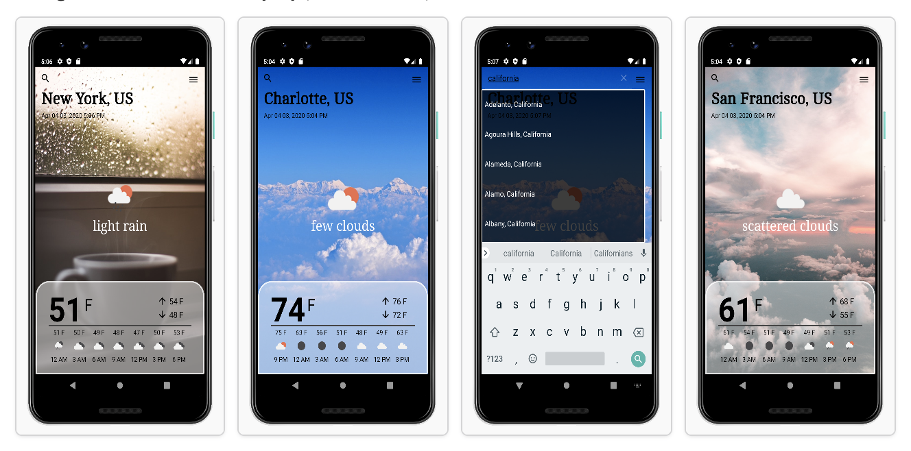

# Daily-Weather-App

The Weather App lets you select your preferred city and display the current weather by making JSON API calls to openweathermap.org API.

Technology Stack:

• MVVM Architecture: ViewModel, Repository, Event Structure

• Google Architecture Components - ViewModel, LiveData

• Communicating with a Yum WebSocket API using OkHttp WebSocket Client

• Communicating with a Yum Rest API using Retrofit2

• Singleton Software Design Pattern.

• Executors, Background Threads and ThreadPools
